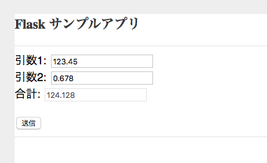

# Flaskサンプルアプリ

## アプリケーションの説明

このアプリケーションは
* サーバーサイド Python Flask
* クライアントサイド Javascript + ajax
で連携するアプリケーションを作る際のサンプルとなっています。
そのままIBM CloudのCloud Foundaryで動くようになっています。

アプリイメージ

  

## 前提
IBM Cloud上にアカウントを持っていることが前提です。(ライトアカウントで可)


## 前提ソフトの導入
次の前提ソフトが導入されていることが前提です。

[gitコマンドラインツール][git] (なくても可)   
[Cloud Foundryコマンドラインツール][cloud_foundry]  
  
注意: Cloud Foundaryのバージョンは最新として下さい。 

## ソースのダウンロード
Githubからアプリケーションのソースをダウンロードします。  
カレントディレクトリのサブディレクトリにソースはダウンロードされるので、あらかじめ適当なサブディレクトリを作り、そこにcdしてから下記のコマンドを実行します。  
GITコマンドを使わない場合は、[Github](https://github.com/makaishi2/cifar10-sample)にブラウザからアクセスして、zipファイルをダウンロード後、解凍します。  
ダウンロード後、できたサブディレクトリにcdします。
 

```sh
$ cd (適当なサブディレクトリ)
$ git clone https://github.com/makaishi2/flask-sample.git
$ cd flask-sample
```

## CFコマンドでログイン
CFコマンドでIBM Cloud環境にログインします。  
ログイン名、パスワードはIBM Cloudアカウント登録で登録したものを利用します。  
ログインに成功すると、次のような画面となります。  

```
$ cf api https://api.ng.bluemix.net
$ cf login
```

  

## アプリケーションのデプロイ

次のコマンドを実行します。
**\<service_name\>** はなんでもいいのですが、インターネット上のURLの一部となるので、ユニークな名前を指定します。  
(例) **wml-kidney-aka**

```
$ cf push <service_name>
```


## アプリケーションのURLと起動

デプロイには数分かかります。デプロイが正常に完了したらアプリケーションを起動できます。  
次のURLをブラウザから指定して下さい。

```
https://<service_name>.mybluemix.net/
```

## アプリケーションを修正する場合

導入手順中、git cloneコマンドでダウンロードしたローカルリポジトリにアプリケーションのソースコードが入っています。  
アプリケーションを修正したい場合は、ローカルのソースを修正し、再度 ``cf push <service_name>`` コマンドを実行すると、IBM Cloud上のアプリケーションが更新されます。  

## ローカルで起動する場合

アプリケーションを修正する時は、ローカルでもテストできる方が便利です。そのための手順は以下の通りです。

* Pythonの導入  
ローカルにPython(v3)を導入する必要があります。　MACの場合は最初から導入済みなのでこの手順は不要です。
```

* Pythonアプリケーションの導入、実行  
以下のコマンドでアプリケーションの導入、実行を行います。

```sh
$ python server.py
```

[cloud_foundry]: https://github.com/cloudfoundry/cli#downloads
[git]: https://git-scm.com/downloads
[sign_up]: https://bluemix.net/registration
 
